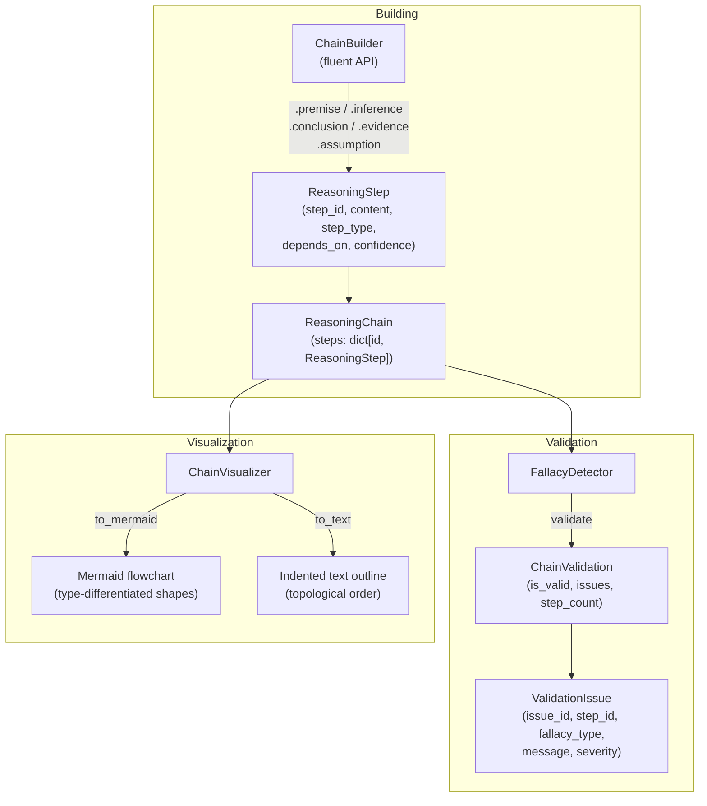

# aumai-reasonflow

> Visual reasoning chain editor and debugger

[](https://github.com/aumai/aumai-reasonflow/actions)
[](https://pypi.org/project/aumai-reasonflow/)
[](LICENSE)
[](https://python.org)

> **Experimental.** Automated logical fallacy detection is a heuristic process.
> The checks implemented here catch common structural errors; they do not
> constitute a complete formal verification of an argument's soundness.

---

## What is this? (Plain English)

When an AI agent makes a decision, it (ideally) does so through a chain of
reasoning:

> **Premise:** All contractors require badge access.
> **Evidence:** Bob's employment record shows contractor status.
> **Inference:** Bob requires badge access.
> **Conclusion:** Bob must be issued a badge.

That looks straightforward. But in complex agentic systems, these chains grow
large, branch, recombine, and sometimes form cycles — which means the reasoning
is circular and invalid.

`aumai-reasonflow` is the tool for building, inspecting, and debugging these
chains:

- **Build** chains with a fluent Python builder API
- **Validate** them automatically — detect circular reasoning, unsupported
  conclusions, broken dependencies
- **Visualize** them as Mermaid flowcharts or indented text outlines

Think of it as a **reasoning IDE**: the same way a code editor catches syntax
errors before you run the program, `aumai-reasonflow` catches logical errors
before you deploy the agent.

---

## Why does this matter? (First Principles)

Explainability in AI is not just about post-hoc saliency maps. It is about
whether the *reasoning path* from inputs to outputs can be inspected, critiqued,
and corrected. For high-stakes decisions (medical, legal, financial, security),
the chain of inference must be auditable.

`aumai-reasonflow` provides the data structures and algorithms to make that
auditability practical:

| Capability | Why it matters |
|---|---|
| Dependency graph | See exactly what each conclusion depends on |
| Cycle detection | Prevent circular justifications in agent reasoning |
| Confidence propagation | Quantify how uncertainty flows through an argument |
| Mermaid export | Include reasoning diagrams in reports and dashboards |
| JSON serialization | Store, version, and diff reasoning chains over time |

**Research context:**

- Walton, "Argumentation Theory" (1996) — classical argument structure
- Toulmin, "The Uses of Argument" (1958) — claim/warrant/backing model
- Biran & Cotton, "Explanation and Justification in Machine Learning"
  (IJCAI 2017)
- Dung, "On the Acceptability of Arguments" (AIJ 1995) — abstract argumentation
- Atkinson et al., "Towards Artificial Argumentation" (AI Magazine 2017)

---

## Architecture



---

## Features

- **Fluent builder API**: method-chained construction with `.premise()`,
  `.inference()`, `.conclusion()`, `.evidence()`, `.assumption()`
- **Six step types**: `PREMISE`, `INFERENCE`, `ASSUMPTION`, `CONCLUSION`,
  `EVIDENCE`, `REBUTTAL`
- **Confidence scores** on individual steps
- **Fallacy detection**: circular reasoning, broken dependencies, unsupported
  conclusions, ungrounded inferences
- **DFS-based cycle detection** that identifies all members of a cycle, not
  just the back-edge endpoint
- **Topological sort** for correct display order
- **Mermaid export** with type-differentiated node shapes
- **JSON serialization** via Pydantic v2 `model_dump_json`
- **CLI**: `build`, `validate`, `visualize` commands
- **Zero heavy dependencies** — pure Python, no external graph library

---

## Quick Start

### Installation

```bash
pip install aumai-reasonflow
```

Or from source:

```bash
git clone https://github.com/AumAI/aumai-reasonflow
cd aumai-reasonflow
pip install -e ".[dev]"
```

### 5-minute example

```python
from aumai_reasonflow.core import ChainBuilder, ChainVisualizer, FallacyDetector

# Build a reasoning chain
chain = (
    ChainBuilder("chain_1", "Badge Access Argument")
    .premise("p1", "All contractors require badge access.")
    .evidence("e1", "Bob's employment record shows contractor status.",
              confidence=0.95)
    .inference("i1", "Bob requires badge access.",
               depends_on=["p1", "e1"], confidence=0.95)
    .conclusion("c1", "Bob must be issued a badge.",
                depends_on=["i1"])
    .build()
)

# Validate for logical fallacies
detector = FallacyDetector()
validation = detector.validate(chain)
print(f"Valid: {validation.is_valid}")    # True
print(f"Issues: {len(validation.issues)}")  # 0

# Visualize as Mermaid
viz = ChainVisualizer()
print(viz.to_mermaid(chain))

# Visualize as text
print(viz.to_text(chain))
```

---

## CLI Reference

### `build` — build a chain from a JSON spec

```bash
aumai-reasonflow build \
  --input spec.json \
  --output chain.json
# Built chain 'My Argument' with 3 step(s) -> chain.json
```

The spec file format:

```json
{
  "chain_id": "chain_1",
  "title": "Syllogism",
  "description": "Classic syllogism example.",
  "steps": [
    {"step_id": "p1", "step_type": "premise",    "content": "All humans are mortal."},
    {"step_id": "p2", "step_type": "premise",    "content": "Socrates is human."},
    {"step_id": "c1", "step_type": "conclusion", "content": "Socrates is mortal.",
     "depends_on": ["p1", "p2"], "confidence": 1.0}
  ]
}
```

| Option | Required | Default | Description |
|---|---|---|---|
| `--input PATH` | Yes | — | Path to JSON chain spec file |
| `--output PATH` | No | `<input>.chain.json` | Output JSON path |

### `validate` — check for logical fallacies

```bash
aumai-reasonflow validate chain.json
```

Output (valid):

```
Chain 'Syllogism': VALID
Steps: 3  Errors: 0  Warnings: 0
```

Output (invalid):

```
Chain 'Broken Argument': INVALID
Steps: 4  Errors: 1  Warnings: 1
  [ERROR] c1: Conclusion 'c1' has no supporting steps.
  [WARN ] i1: Inference 'i1' has no premise or evidence dependencies.
```

Exit code 1 on invalid chains — suitable for CI pipelines.

### `visualize` — render a chain

```bash
# Plain text (default)
aumai-reasonflow visualize chain.json

# Mermaid diagram
aumai-reasonflow visualize chain.json --format mermaid

# Write to file
aumai-reasonflow visualize chain.json --format mermaid --output chain.mmd
```

| Option | Required | Default | Description |
|---|---|---|---|
| `CHAIN_FILE` | Yes (positional) | — | Path to saved chain JSON |
| `--format` | No | `text` | `text` or `mermaid` |
| `--output PATH` | No | stdout | Write output to file |

---

## Python API Examples

### Building a chain with all step types

```python
from aumai_reasonflow.core import ChainBuilder

chain = (
    ChainBuilder("risk_chain", "Credit Risk Assessment")
    .premise("p_income", "Applicant income is above threshold.")
    .premise("p_history", "Applicant has no defaults in last 5 years.")
    .assumption("a_stable", "Income is expected to remain stable.",
                confidence=0.75)
    .evidence("e_report", "Credit bureau report confirms clean history.",
              depends_on=["p_history"], confidence=0.92)
    .inference("i_low_risk", "Applicant is low credit risk.",
               depends_on=["p_income", "p_history", "e_report", "a_stable"],
               confidence=0.85)
    .conclusion("c_approve", "Approve loan application.",
                depends_on=["i_low_risk"])
    .build()
)
```

### Validating and reading issues

```python
from aumai_reasonflow.core import FallacyDetector

detector = FallacyDetector()
validation = detector.validate(chain)

print(f"Valid: {validation.is_valid}")
print(f"Steps: {validation.step_count}")

for issue in validation.errors:
    print(f"ERROR [{issue.fallacy_type.value}] at '{issue.step_id}': {issue.message}")

for issue in validation.warnings:
    print(f"WARN  [{issue.fallacy_type.value}] at '{issue.step_id}': {issue.message}")
```

### Saving and loading chains

```python
from pathlib import Path
from aumai_reasonflow.models import ReasoningChain
import json

# Save to JSON
Path("risk_chain.json").write_text(chain.model_dump_json(indent=2), encoding="utf-8")

# Load from JSON
data = json.loads(Path("risk_chain.json").read_text(encoding="utf-8"))
loaded_chain = ReasoningChain.model_validate(data)
```

### Querying steps by type

```python
# Get all premises
for step in chain.get_premises():
    print(f"Premise: {step.content}")

# Get all conclusions
for step in chain.get_conclusions():
    print(f"Conclusion [{step.confidence:.0%}]: {step.content}")

# Access a specific step
step = chain.steps["i_low_risk"]
print(f"Depends on: {step.depends_on}")
```

---

## Mermaid Node Shapes by Step Type

`ChainVisualizer.to_mermaid()` uses distinct Mermaid shapes for each step type:

| Step type | Mermaid syntax | Rendered shape |
|---|---|---|
| `PREMISE` | `([...])` | Stadium / rounded rectangle |
| `INFERENCE` | `[...]` | Rectangle |
| `ASSUMPTION` | `{...}` | Diamond |
| `CONCLUSION` | `((...))` | Circle |
| `EVIDENCE` | `[/.../]` | Parallelogram |
| `REBUTTAL` | `[\ ... \]` | Reverse parallelogram |

---

## How It Works (Deep Dive)

### Data Model

A `ReasoningChain` is a directed acyclic graph stored as a
`dict[str, ReasoningStep]`. Each step records its own ID, type, content, and
the IDs of its dependencies (edges point from dependency to dependent step).

### Topological Sort

`ChainVisualizer._topological_sort` uses DFS-based topological ordering. Roots
(steps with no dependencies) appear first; conclusions appear last. This
guarantees the text output reads in logical dependency order.

### Cycle Detection

`FallacyDetector._detect_cycles` uses the standard white/gray/black DFS
coloring algorithm (Cormen et al., CLRS). When a gray ancestor is found:

1. Its index in the current DFS path stack is located.
2. All nodes from that index to the end of the stack are added to the cyclic
   set.

This correctly identifies all members of a cycle, not just the back-edge pair.

### Depth Computation

`ChainVisualizer._depth` recursively computes the maximum dependency depth of
each step (0 = no dependencies). A `visited` set is threaded through to break
cycles during depth computation, preventing infinite recursion on invalid chains.

---

## Integration with Other AumAI Projects

| Project | Integration point |
|---|---|
| `aumai-neurosymbolic` | Export chain steps as Horn-clause rules for symbolic verification |
| `aumai-policyminer` | Represent each `MinedPolicy` as an inference node in a chain |
| `aumai-specs` | Use `ChainValidation` as a pre-deployment structural check |
| `aumai-guardrails` | Validate that agent reasoning chains pass structural checks before execution |

---

## Limitations and Experimental Caveats

- **Structural checks only:** `FallacyDetector` checks graph structure, not
  semantic validity. It will not detect content-level fallacies.
- **Flat dependency model:** `depends_on` is a flat list. Disjunctive
  dependencies ("depends on A OR B") are not expressible.
- **Rebuttal semantics:** `StepType.REBUTTAL` is defined in the model but not
  yet given special semantic treatment by `FallacyDetector`.
- **No persistence layer:** chains are plain JSON. Versioning and diffing are
  not built in.

---

## Documentation

- [Getting Started](docs/getting-started.md)
- [API Reference](docs/api-reference.md)
- [Examples](examples/)
- [Contributing](CONTRIBUTING.md)

---

## AumOS Governance Integration

`aumai-reasonflow` operates as a standalone tool. For enterprise-grade
governance, reasoning chains can be versioned and diff'd in AumOS, and
`FallacyDetector` validation can be enforced as a gate in agent deployment
pipelines.

---

## Contributing

We welcome contributions! See [CONTRIBUTING.md](CONTRIBUTING.md).
Run `make lint test` before submitting. Conventional commits:
`feat:`, `fix:`, `refactor:`, `test:`, `docs:`.

---

## License

Apache 2.0 — see [LICENSE](LICENSE) for details.

## Part of AumAI

This project is part of [AumAI](https://github.com/aumai) — open source
infrastructure for the agentic AI era.
